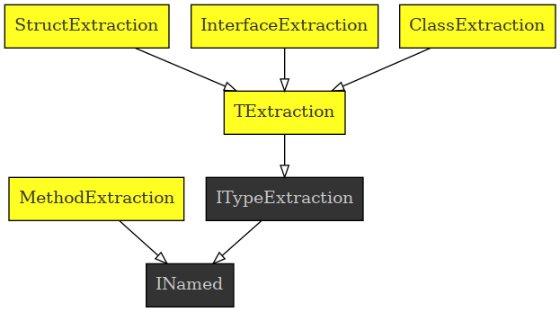

# csharp code diagrams

Generate graphviz diagrams out of csharp source files.

## todot

The project todot contains a command line program that can be calledas follows:
```
dotnet run --input ../extractor --relation Parents, Children --contextcenter ITypeExtraction | dot -Tsvg > typerelations.svg
```
As input a folder is specified and all csharp source files in it are considered. Any number of commma separated relation type can be provided to the relation parameter and one type has to be specified as the initial type which relation neighbors are searched from.

The output looks as follows:



Starting from the context center, all parents and children are searched, and for each of the type, all parents and children are searched. We collect all nodes of the type network that are overnext neighbors with respect to the relation types provided.

The following relation types are available:
- Parents: class inheritance *and* interface implementation are collected
- Children: same as previous, but the other way around
- Referenced: referenced members, properties of fields
- Referencing: same as previous, but the other way around
- MethodReturns: return types of methods
- MethodReturned: same as previous, but the other way around
- MethodArgs: arguments of methods
- UsedAsArg: same as previous, but the other way around
- Callers: types that are referenced from within methods
- Callees: same as previous, but the other way around